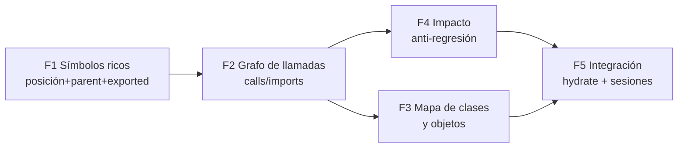

# PLAN — Repo Map v2: funciones, clases/objetos e impacto anti-regresión

> Estado: **propuesto** (2026-07-11). Diseño para que el repo map extraiga funciones
> principales, funciones compuestas (grafo de llamadas) y un mapa de clases/objetos,
> con **recuperación de impacto** («¿dónde afecta este cambio?») para prevenir
> regresiones — integrado con los tres diferenciadores del harness: memoria durable,
> carga de contexto inteligente (hydrate) y medición de uso por sesión.

## 1. Estado actual (diagnóstico con evidencia)

Pipeline hoy: `parseTree` → `rankSymbols` (PageRank estilo Aider) → `SymbolModel`
(colección `symbols`) → `RepoMap.render` (presupuesto de tokens) → sección `repomap`
de `hydrate()` (ADR-0016) y tools MCP `get_repomap` / `get_module_map` /
`get_module_brief` (ADR-0053).

| Pieza | Archivo | Qué hace hoy |
|---|---|---|
| Parser | `src/repomap/parser.ts:142-168` | tree-sitter si hay gramática `.wasm`; si no, heurística regex (`parseFileHeuristic`, `parser.ts:107-132`) |
| Defs | `parser.ts:81-92` | `[name, kind]` por archivo: `function`, `class`, `interface`, `type`, `enum`, arrow `const`, `def/func/fn` |
| Refs | `parser.ts:128-130` | TODOS los identificadores del archivo, planos, sin scope |
| Ranker | `src/repomap/ranker.ts:23-60` | PageRank α=0.85 sobre `file → def(archivo_definidor, name)` |
| Store | `src/repomap/store.ts:32-70` | `deleteMany` + `insertMany` por `(project, repo)`, sella `branch` (ADR-0037) |
| Modelo | `src/models/symbol.model.ts:20-35` | `{project, repo, branch, file, name, kind, refs[], pagerank, mtime}` |
| Render | `store.ts:73-102` + `ranker.ts:101-116` | top-K por presupuesto (~6 tok/símbolo), agrupado por archivo |

### Brechas (por qué hoy NO se puede responder «¿dónde afecta?»)

- **G1 — Métodos de clase invisibles (heurística).** Los patrones de
  `HEURISTIC_DEFS` solo capturan `function/class/interface/type/enum/arrow/def/func/fn`.
  Un método `async build(root: string)` dentro de una clase **no matchea ninguno**:
  en este mismo repo, `RepoMap.build/render` no existen como símbolos — solo
  `class RepoMap`. Las «funciones principales» de un código orientado a clases
  quedan fuera del mapa.
- **G2 — Refs a nivel archivo y con tope.** `refs` es un `Set` plano por archivo,
  recortado a 50 (`store.ts:62`). No se sabe *qué función* referencia *qué símbolo*
  → imposible derivar funciones compuestas (quién llama a quién).
- **G3 — Sin posiciones.** Ningún símbolo guarda `line_start/line_end` → no se puede
  cruzar con hunks de `git diff` ni generar briefs navegables.
- **G4 — Sin jerarquía ni firma.** No hay `parent` (clase→método), ni `exported`,
  ni `signature` → el mapa de clases/objetos no es reconstruible.
- **G5 — Sin aristas persistidas.** El grafo del ranker se calcula y se tira; solo
  sobrevive el score. No hay colección de edges → no hay consulta inversa
  («¿quién depende de X?»).
- **G6 — Cache incremental prometida pero no implementada.** El docstring de
  `store.ts:4-6` promete «unchanged files are not re-parsed», pero `build()` borra
  todo y reinserta; `mtime` se guarda y nunca se compara.
- **G7 — Gramáticas tree-sitter sin empaquetar.** `loadLanguage` (`parser.ts:61-77`)
  degrada siempre a heurística porque los `.wasm` no se distribuyen
  (`TODO(phase 2)`).

## 2. Diseño v2 — cinco fases incrementales



### F1 — Símbolos con posición y jerarquía

Extender `FileSymbols` y el modelo `Symbol` con:

```ts
// symbol.model.ts (aditivo, docs viejos siguen siendo válidos)
line_start: number; line_end: number;   // rango de la definición
parent: string | null;                   // "RepoMap" para el método build
exported: boolean;                       // ¿parte de la API del módulo?
signature: string;                       // primera línea recortada
kind: +"method" | +"property"           // nuevos kinds
```

- Heurística: nuevo pase *scope-aware* — tracker de llaves balanceadas que mantiene
  la pila de scopes (`class X {` abre scope; `name(args) {` a profundidad 1 de una
  clase = método). Cierra **G1** y da posiciones sin dependencias nuevas.
- tree-sitter: `walk()` ya visita nodos con `startIndex/endIndex` → mapear a líneas
  y usar la pila de ancestros para `parent`. Cierra **G7** empaquetando los `.wasm`
  de `typescript/tsx/javascript/python` (los lenguajes del laboratorio) vía
  `AITL_GRAMMAR_DIR` con descarga perezosa opcional.
- Arreglar **G6** de paso: comparar `mtime` y re-parsear solo archivos cambiados
  (delete+insert por archivo, no por proyecto).

**Aceptación F1:** `RepoMap.build` y `runAgent` aparecen como símbolos `method`/
`function` con `parent`, `exported` y rango de líneas correctos en este repo;
re-build sin cambios no re-parsea (evento con `files_reparsed: 0`).

### F2 — Grafo de llamadas → funciones principales y compuestas

Atribuir refs al **símbolo que las contiene** (por rango de líneas de F1) en vez de
al archivo, y persistirlas como aristas:

```ts
// nueva colección symbol_edges (misma disciplina project/repo/branch que symbols)
{ project, repo, branch,
  from: { file, name },        // el símbolo que referencia
  to:   { file, name },        // el símbolo definido referenciado
  kind: "calls" | "imports" | "extends" | "implements" | "instantiates",
  count: number }              // nº de sitios de llamada
```

- `imports`: parsear los `import ... from "./x.js"` de TS/JS por regex — precisos y
  baratos; dan el grafo archivo→archivo aunque la resolución de llamadas falle.
- El PageRank pasa a correr sobre el grafo símbolo→símbolo (hoy archivo→símbolo),
  mejorando el ranking de «funciones principales».
- Definiciones operativas:
  - **Función principal** = top-N PageRank ∪ entry points (`exported` referenciados
    desde `src/cli.ts` / `src/mcpserver/` / `src/server/`).
  - **Función compuesta** = out-degree > 0 en aristas `calls` (orquesta a otras);
    **hoja** = out-degree 0. El render las distingue (`◆ compuesta / · hoja`).

**Aceptación F2:** consulta «callees de `runAgent`» devuelve (al menos) `hydrate`,
`deliberate` y los helpers del loop; «callers de `hydrate`» incluye `runAgent` y el
comando `hydrate` del CLI; los edges quedan sellados por branch.

### F3 — Mapa de clases y objetos

Con `parent` (F1) + aristas `extends/implements/instantiates` (F2):

- `aitl repomap --classes [--dir src/x]`: árbol módulo → clase → métodos/props con
  firma, marcando `exported` y dónde se instancia cada clase (`new X` → arista
  `instantiates`).
- Objetos relevantes: literales exportados (`export const store = {...}`) ya
  capturados como `const` en F1; se listan como «objetos» del módulo.
- Se anida en el module map existente (`src/repomap/modules.ts`, ADR-0053): cada
  módulo view/back/mixed/infra despliega sus clases.

**Aceptación F3:** el render de `src/repomap/` muestra `RepoMap {build(), render()}`
instanciada desde los call-sites reales del CLI/MCP.

### F4 — Impacto y anti-regresión (la consulta inversa)

El corazón del pedido: **recuperar dónde afecta el código implementado.**

- `impact(target, depth)` = clausura transitiva INVERSA sobre `symbol_edges`
  (callers + importers), con presupuesto de profundidad/tamaño. Target: símbolo,
  archivo o `--diff` (símbolos cuyo rango interseca los hunks del `git diff`
  — necesita F1).
- Superficies:
  - CLI `aitl impact <símbolo|archivo|--diff> [--depth N] [--tests] [--json]`
  - Tool MCP `get_impact { project, target, depth?, repo?, branch? }`
- **Tests afectados**: archivos `*.test.ts` dentro del radio → `--tests` imprime la
  lista y sugiere el gate focalizado:
  `aitl run --verify-cmd "node --import tsx --test <tests afectados>"`.
  Regresión evitada = el gate correcto se elige por datos, no por memoria del agente.
- Evento nuevo `impact_check {target, radius: {symbols, files, tests}}` para la
  telemetría (métrica #9 trazabilidad).

**Aceptación F4:** `aitl impact src/repomap/parser.ts --tests` lista
`repomap.test.ts` + los tests de los consumidores (store/indexing); `--diff` sobre
un cambio en `ranker.ts` marca `RepoMap.build` en el radio.

### F5 — Integración con el «plus» del harness

1. **Contexto inteligente (hydrate):** nueva fuente best-effort en
   `hydrate()` (`src/memory/lifecycle.ts`, patrón ADR-0016): si el prompt menciona
   símbolos conocidos (match léxico contra `symbols.name`), inyectar su
   **symbol-brief**: firma + módulo + callers/callees top-N + ADRs por
   `components[]` + memorias `component:<dir>` (generaliza `module-brief`,
   ADR-0053). Presupuesto propio y opt-out en `HydrateOpts`, como las demás
   secciones.
2. **Memoria durable:** `capture-session` (ADR-0022) hoy taguea por directorio
   (`component:<dir>`); con F1 resuelve además los **símbolos editados** del diff de
   la sesión y taguea `symbol:<name>` → el recall «¿qué sabemos de runAgent?»
   devuelve las sesiones que lo tocaron.
3. **Medición de sesiones:** el run doc gana `symbols_touched[]` y
   `blast_radius {symbols, files, tests}`; `aitl run-show` los reporta y permite la
   métrica nueva: **riesgo de regresión por sesión** = tests en el radio que NO se
   ejecutaron antes de terminar el run (candidata a #10 de la Tabla 4.3).

**Aceptación F5:** una corrida que edita `ranker.ts` termina con
`symbols_touched=[rankSymbols,...]`, radio calculado, y `run-show` muestra si el
gate cubrió los tests del radio.

## 3. Decisiones de diseño y alternativas

- **Parser:** mantener la dualidad tree-sitter/heurística (filosofía F9: degradar,
  nunca fallar). Se consideró `ts-morph`/compiler API (precisión máxima solo-TS):
  queda como **F6 opcional** detrás de flag — dependencia pesada y rompe la
  generalidad multi-lenguaje del laboratorio (python/go del raytracer).
- **Resolución de llamadas heurística:** `nombre(` dentro del rango de un símbolo →
  arista `calls` hacia el definidor del nombre (ambigüedad: todos los definidores,
  igual que hoy hace el ranker en `ranker.ts:37-46`). Falsos positivos aceptables:
  el impacto debe ser **conservador** (mejor sobre-avisar que callar una regresión).
- **Almacenamiento:** colección nueva `symbol_edges` en vez de embeber edges en
  `symbols` — la consulta inversa (`to.name = X`) necesita índice propio
  `{project, repo, "to.file", "to.name"}`; los símbolos siguen siendo la unidad de
  render.
- **Compatibilidad:** todo aditivo. `get_repomap` no cambia su salida por defecto;
  los campos nuevos tienen default y los docs viejos siguen siendo válidos
  (mismo criterio que la migración Mongoose, ADR-0036).

## 4. Orden de ejecución y esfuerzo estimado

| Fase | Entrega | Esfuerzo | Riesgo |
|---|---|---|---|
| F1 | símbolos ricos + fix cache mtime | 1 sesión | bajo (aditivo) |
| F2 | symbol_edges + PageRank símbolo→símbolo | 1-2 sesiones | medio (resolución de nombres) |
| F4 | `aitl impact` + `get_impact` + tests afectados | 1 sesión | bajo (consulta sobre F2) |
| F3 | `repomap --classes` | 0.5 sesión | bajo (render sobre F1/F2) |
| F5 | hydrate symbol-brief + symbols_touched + métrica | 1 sesión | bajo (patrones ya existentes) |

F4 va antes que F3 a propósito: el valor anti-regresión es el objetivo; el render de
clases es presentación. Cada fase cierra con tests en `src/repomap/*.test.ts`
(los 401 actuales siguen verdes) y su ADR al aterrizar.

## 5. Registro

- Este plan se registra como ADR **proposed** en el ledger de `aitl-js` y como
  memoria `plan-repomap-v2` (type project). Al implementar cada fase, su ADR
  «accepted» referencia a este documento.
