# Arquitectura de AITL-Harness-JS

> **Documento canónico** de la arquitectura del harness (consolidado 2026-07-06, tras
> ADR-0056). La revisión histórica en inglés con formato de auditoría
> (`ARQUITECTURA-AITL-JS.md`) y los planes de ciclo viven archivados en
> [`docs/attic/`](attic/); su historial completo está en el ledger de decisiones
> (colección `decisions`, proyecto `aitl-js`, espejo en [`docs/adr/`](adr/)).
>
> **Qué es.** Un *harness* de agentes **model-agnostic**: orquesta el loop de un agente
> (prompt → modelo → herramientas → repetir), persiste **todo** (transcript, memoria, decisiones,
> eventos de traza) en un único store durable (MongoDB + Atlas Vector Search) y expone ese estado
> por **CLI**, **MCP**, **HTTP/UI** y **adapters cross-tool**.
>
> **Stack.** TypeScript (ESM, Node ≥ 20) · loop propio `runAgent` (prompt→modelo→tools→repeat,
> resumible desde el transcript durable — ADR-0047; sin framework de grafos) ·
> MongoDB + Atlas Vector Search (store único; capa de datos **Mongoose**,
> `src/models/*.model.ts` — ADR-0036) · embeddings locales `Xenova/all-MiniLM-L6-v2`
> (384 dims) por defecto, con fallback a Voyage.
>
> Las referencias `archivo.ts:línea` apuntan al símbolo exacto (las líneas pueden derivar;
> el nombre del símbolo es el ancla real).

---

## 1. Principio rector: puertos y adaptadores (hexagonal)

El **núcleo** (loop, contexto, memoria) depende **solo de puertos** (`contracts.ts`), nunca de un
SDK concreto. Esto es lo que hace al harness agnóstico de modelo, de herramienta y de almacenamiento.

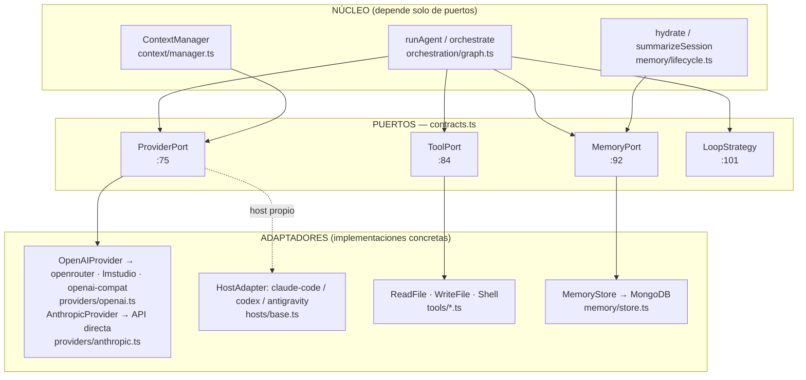

**Puertos (`src/contracts.ts`):**

| Puerto | Línea | Responsabilidad |
|---|---|---|
| `ProviderPort` | `contracts.ts:75` | `chat()`, `complete()`, `countTokens()`, `capabilities()` — cualquier gateway LLM |
| `ToolPort` | `contracts.ts:84` | `run(args) → string` — herramienta invocable con JSON-schema |
| `MemoryPort` | `contracts.ts:92` | `upsertMemory`, `appendMessage`, `logEvent`, `vectorSearch`, `textSearch` |
| `LoopStrategy` | `contracts.ts:101` | `run(prompt, project, opts)` — cómo se conduce una tarea |

> **Invariantes** (ADR-0019/0020, **SUPERSEDED en parte por ADR-0044**): el invariante original
> "un único gateway de modelo = OpenRouter" fue enmendado el 2026-07-02. Hoy `getProvider` resuelve
> **cuatro backends crudos**: `anthropic` (SDK oficial directo, `providers/anthropic.ts`: prompt
> caching, structured outputs, tool blocks nativos) · `openrouter` · `lmstudio` · `openai-compat`
> (estos tres vía el cliente genérico `OpenAIProvider` + `baseURL`, que sigue siendo el único
> cliente OpenAI-compatible — esa parte de ADR-0019 se mantiene). `--model auto` detecta el primer
> backend configurado y encadena el resto como `FallbackProvider`; `AITL_API_KEY` única se
> clasifica por prefijo (`sk-ant-*`/`sk-or-*`). Sigue vigente: los *hosts* externos (Claude Code,
> Codex, Antigravity) corren su **propio loop** y se manejan vía `HostAdapter`, no vía `getProvider`.

---

## 2. Mapa de componentes

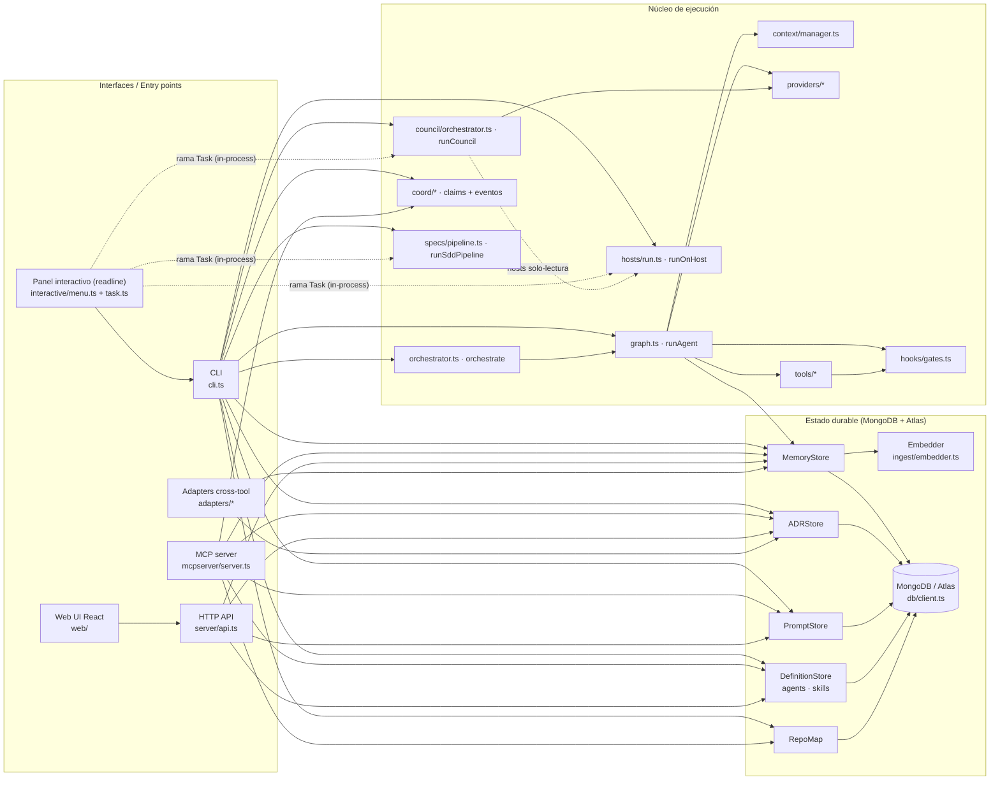

---

## 3. Flujo de un *run* de agente (`runAgent`)

`runAgent(prompt, project, opts)` (`orchestration/graph.ts:89`) es la estrategia principal:
conduce el loop, llama al modelo, ejecuta herramientas (pasando por *gates*), y emite eventos de
traza en cada paso.

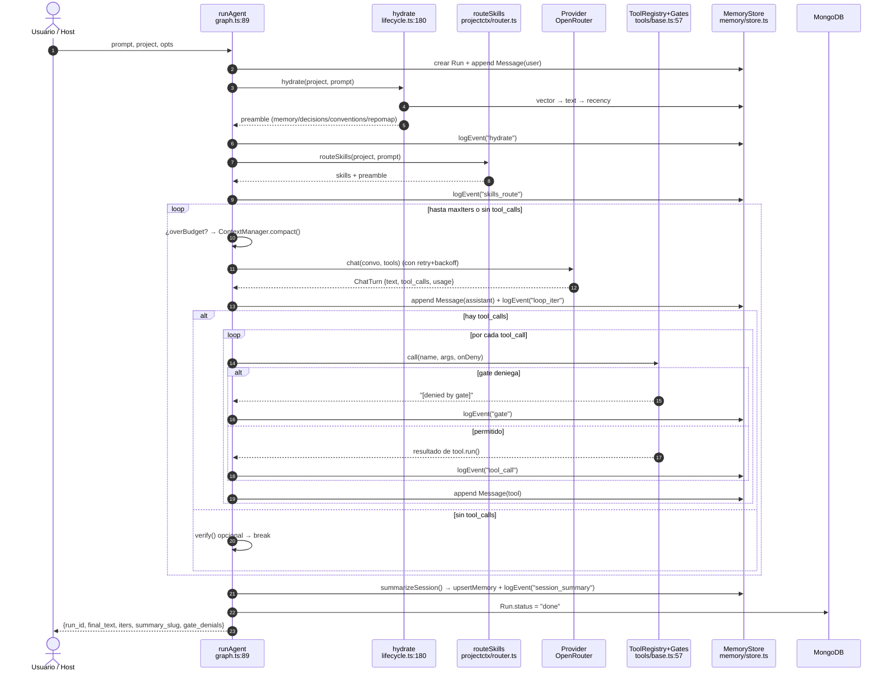

**Eventos de traza emitidos** (colección `events`, modelo `models/event.model.ts`): `hydrate`,
`skills_route`, `loop_iter`, `tool_call`, `gate`, `compaction`, `retry`, `verify`,
`session_summary`, `spawn`, `synthesis`, `resume`, `error`.

> Los *hooks* de sesión (`hydrate`, `routeSkills`, `summarizeSession`) son **best-effort**: si
> fallan, se capturan y se loguean — **nunca rompen el run**.

---

## 4. Intercepción de herramientas: `ToolRegistry` + gates

Cada llamada a herramienta pasa por `ToolRegistry.call()` (`tools/base.ts:57`), que ejecuta los
*gates* en orden; la primera denegación bloquea la ejecución.

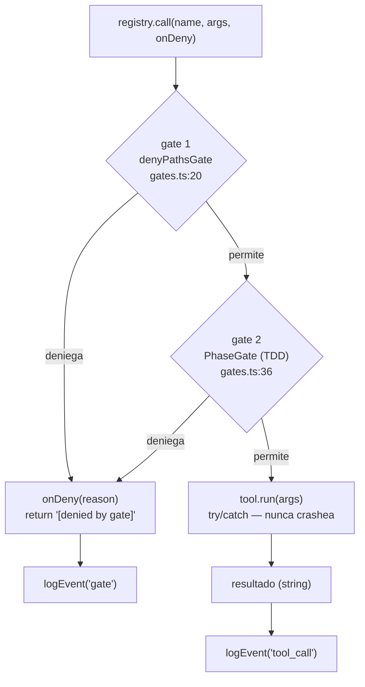

Gates por defecto (`installDefaultGates`, `gates.ts:57`): bloquean `.git/*`, `*.env`, `*.pem`,
`*id_rsa*` sobre `write_file`/`shell`. Herramientas concretas: `ReadFileTool`, `WriteFileTool`
(`tools/filesystem.ts`), `ShellTool` (`tools/shell.ts`).

---

## 5. Orquestación: master → sub-agentes (fan-out)

`orchestrate(master, project, opts)` (`orchestration/orchestrator.ts:63`) **no es un loop**:
descompone una tarea, lanza N `runAgent` en paralelo (memoria compartida) y **sintetiza** los
resultados.

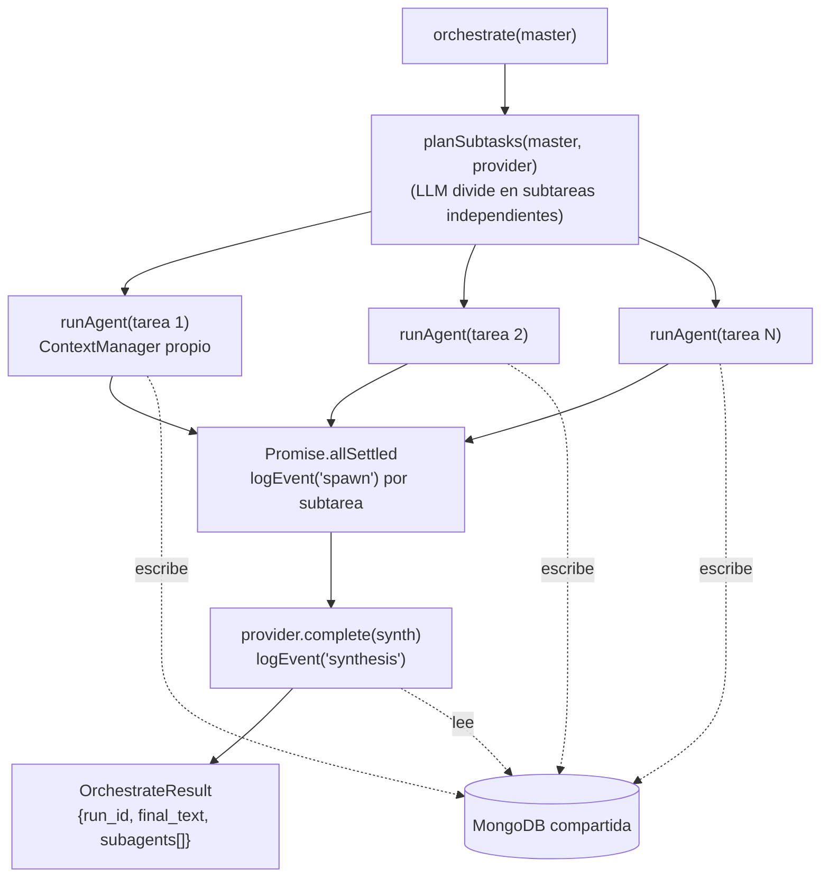

Cada sub-agente tiene su **propio `ContextManager`** (los contextos no se mezclan) pero comparten
la misma MongoDB, así el sintetizador ve todos los resultados.

---

## 6. Dos formas de ejecutar: harness-conduce vs. host-conduce

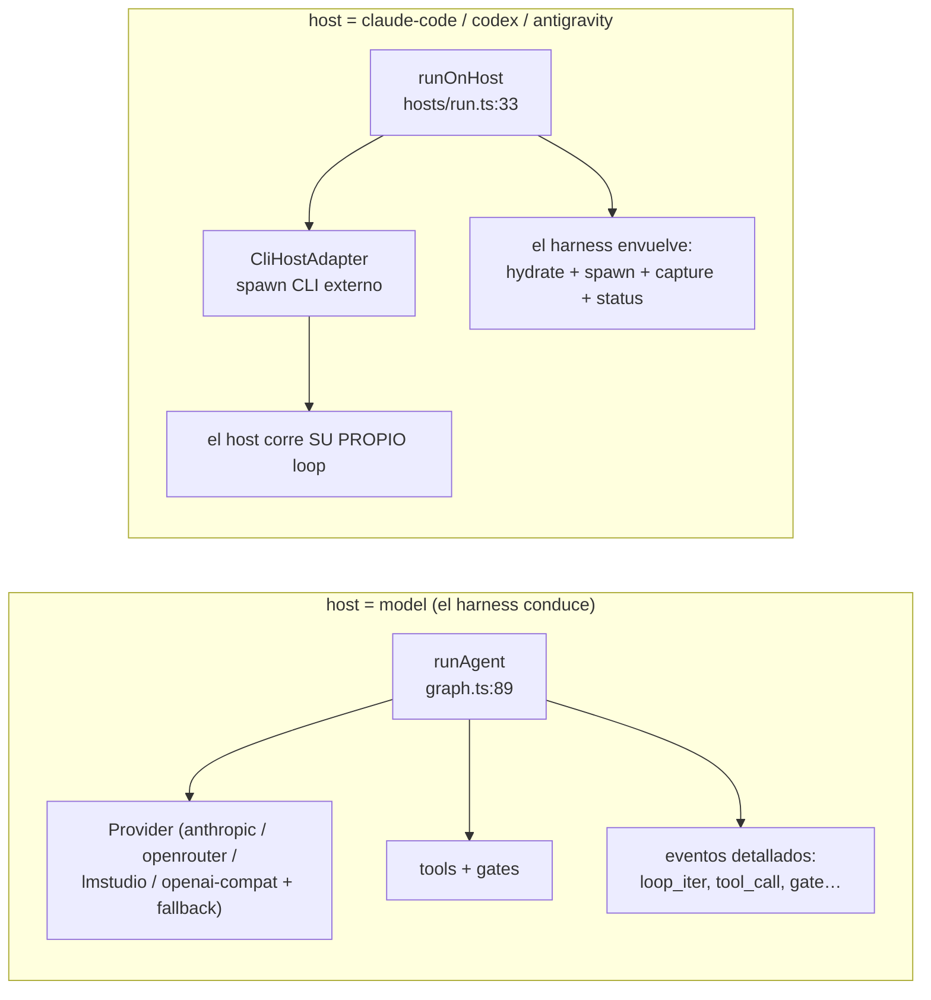

- **`host: model`** → el harness conduce el loop con `model` vía uno de los providers crudos
  (`anthropic`/`openrouter`/`lmstudio`/`openai-compat`, con fallback entre ellos — ADR-0044);
  queda el modelo exacto en el run.
- **`host: claude-code|codex|antigravity`** → `CliHostAdapter` (`hosts/base.ts`) lanza el CLI
  (`HOST_SPECS`; override por env `AITL_HOST_CMD_<NAME>`, argv extra por
  `AITL_HOST_ARGS_<NAME>`). El harness aporta la capa durable alrededor (hidratación de
  contexto, evento `spawn`, captura de la transcripción). Los **permisos viajan explícitos en
  el argv** (ADR-0058): claude-code corre con `--permission-mode acceptEdits` por defecto (o
  `--permission-mode plan` en readonly/council), y `run-host --allowed-tools` pre-aprueba
  herramientas — nunca se depende de settings/trust del directorio destino.

---

## 7. El ciclo harness-v2 (ADRs 0046–0056)

El ciclo 2026-07-05/06 convirtió el prototipo en herramienta operativa. Cada pieza tiene su ADR
(espejo en `docs/adr/`); aquí solo el mapa:

| Capacidad | Qué añade | ADR | Código |
|---|---|---|---|
| Auth web de sesión | `sessions` con hash de token + TTL, login/logout, escrituras delegadas, CORS por allowlist | 0046 | `server/api.ts`, `auth/*` |
| Loop propio | retiro de LangGraph: `runAgent` único, resumible desde el transcript durable | 0047 | `orchestration/graph.ts` |
| Conexión única | Mongoose dueño de la conexión; `db/client.ts` queda como capa compat; factorías async | 0048 | `db/mongoose.ts` |
| Anclaje a commit + ciclo de vida de ADRs | `commit_sha` en stores; `deprecated`/`superseded_by`/`review_after`; `aitl adr deprecate` | 0049 | `decisions/*` |
| Signup + config web | registro self-service (primer usuario real → admin), pestaña Config con espejo a `.env` | 0050 | `server/*`, `config/envfile.ts` |
| Sync markdown bidireccional | espejo legible `.aitl/{memory,skills,agents}/` + `docs/adr/`; manifiesto de dos hashes; conflictos sin merge | 0051 | `sync/*` |
| `aitl init` | bootstrap de repo en un comando, idempotente + degradación sin backend/modelo | 0052 | `init/*` |
| Mapa de módulos | `repomap --modules` (view/back/mixed/infra) + `module-brief <dir>` (ADRs por `components[]`) | 0053 | `repomap/modules.ts` |
| Coordinación mínima | `task_claims` con lock atómico + caducidad; `coord_events`; `aitl coord {claim,release,list,poll}` con cursor incremental | 0054 | `coord/*` |
| Consejo de planeación | propuestas paralelas → crítica anonimizada con rúbrica ponderada → juez independiente; hosts en solo-lectura | 0055 | `council/*` |
| Rama «Task» del panel | punto de entrada operativo: Planear (SDD preview confirm-before-persist) / Delegar / Council; MCP + `coord poll` al entrar | 0056 | `interactive/task*.ts`, `specs/pipeline.ts` |

Contrato transversal de **degradación**: sin Mongo los flujos corren con un aviso y no persisten;
sin modelo, las rutas con LLM caen a su alternativa determinista o se deshabilitan con la razón
visible (ADR-0052, F9).

---

## 8. Estado durable: colecciones y relaciones

Fuente de verdad de colecciones: `COLLECTIONS` en `db/client.ts:18`. Tres llevan `embedding` y se
indexan para Atlas Vector Search: `VECTOR_COLLECTIONS = ["messages","memory","decisions"]`
(`db/indexes.ts:16`).

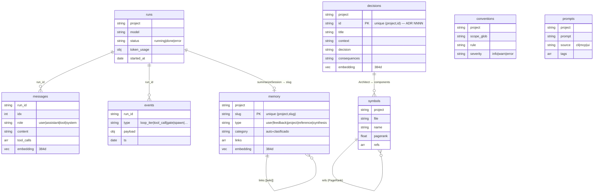

**Colecciones canónicas (`COLLECTIONS`, 13):** `runs`, `messages`, `memory`, `decisions`,
`prompts`, `mcp_context`, `mcp_tool_calls`, `users`, `audit`, `symbols`, `conventions`,
`categories`, `events`.
**Satélites (fuera de `COLLECTIONS`, por paridad Python↔TS):** `agents`, `skills` (vía
`DefinitionStore`).

| Store | Colección(es) | Clave única | Archivo |
|---|---|---|---|
| `MemoryStore` | `memory`, `messages`, `events`, `runs` | `(project, slug)` | `memory/store.ts:18` |
| `ADRStore` | `decisions` | `(project, id)` | `decisions/adr.ts` |
| `PromptStore` | `prompts` | — | `prompts/store.ts:13` |
| `DefinitionStore` | `agents`, `skills` | `(project, name)` | `projectctx/store.ts:19` |
| `RepoMap` | `symbols` | `(project, file/name)` | `repomap/store.ts` |

---

## 9. Conexión resiliente a MongoDB (Atlas + fallback)

`connectWithFallback()` (`db/client.ts:95`) prueba el URI primario y, si falla, el de respaldo —
permite migrar local ↔ Atlas sin tocar código (ADR-0002). La config se resuelve por capas
(`config.ts:62`): `process.env > ~/.aitl/config.json > defaults de zod`.

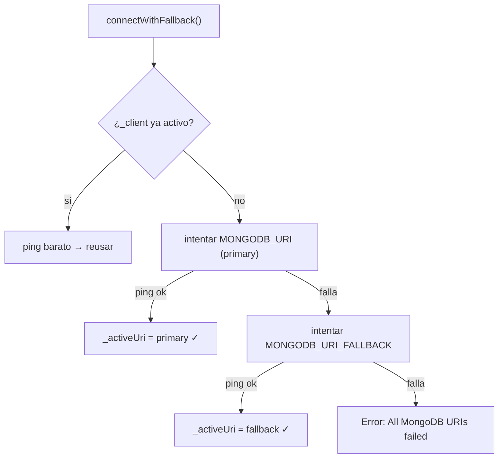

> Nota operativa: si el `.env` no se carga en el shell (p. ej. arrancar el MCP sin él), el URI cae
> al default `mongodb://localhost:27017` y la conexión a Atlas no ocurre. `src/config.ts` hace
> `import 'dotenv/config'` y `normalizeMongoUri()` (`config.ts:13`) repara URIs JSON-escapados.

---

## 10. Ciclo de vida de la memoria

`hydrate → (run) → classify → embed → summarizeSession → synthesize`. Cada paso con LLM tiene un
**fallback determinista** (el sistema funciona sin proveedor).

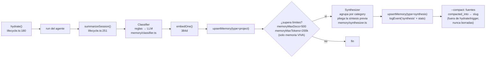

**Compresión rodante (ADR-0059).** `aitl synthesize` comprime de verdad, no solo resume:
cada corrida pliega la síntesis previa de la categoría más los docs nuevos (no re-lee todo el
banco); con modelo, el resumen es map-reduce sobre lotes acotados (nada se trunca en silencio;
una respuesta vacía del modelo cae al extractivo — una síntesis jamás queda en blanco); con
`--compact`, las fuentes absorbidas se estampan con `compacted_into` y salen de la memoria viva
(preámbulo de hydrate + trigger de crecimiento) **sin borrarse**: siguen versionadas, espejadas
por `sync` y alcanzables por búsqueda explícita (recall profundo) — el mismo ciclo de vida
suave de los ADRs (ADR-0049). El evento `synthesis` registra chars antes→después por categoría
(métrica #8, memoria).

### Cascada de recuperación (en `hydrate` y en búsqueda)

Funciona aunque el índice vectorial de Atlas no exista todavía: **vector → texto → recencia**.

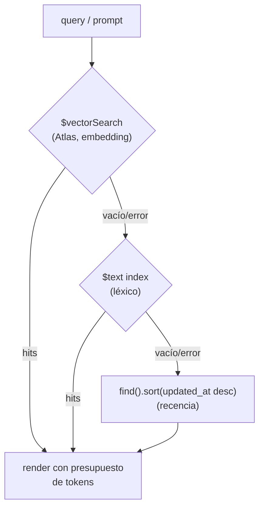

**Clasificador** (`memory/classifier.ts`): reglas-primero (regex por categoría:
decision/convention/bug/task/reference) y **LLM solo como desempate** si hay proveedor.
`TRIGGER_CATEGORIES = {decision, bug, convention, reference}` marca qué resúmenes se guardan.

**Embeddings** (`ingest/embedder.ts`): `LocalEmbedder` (Xenova `all-MiniLM-L6-v2`, 384d, sin API
key) por defecto; `VoyageEmbedder` (1024d) opcional. `embeddingDims` **debe** coincidir con el
índice vectorial (`db/indexes.ts:67`).

---

## 11. Repo map: símbolos + PageRank

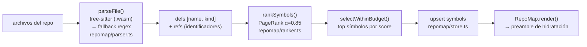

`RepoMap.build()` construye el grafo de dependencias (fichero → símbolo definido en otro),
corre PageRank y guarda `pagerank` por símbolo; `render()` selecciona los más centrales dentro de
un presupuesto de tokens y los inyecta en la hidratación.

---

## 12. Superficie de interfaces

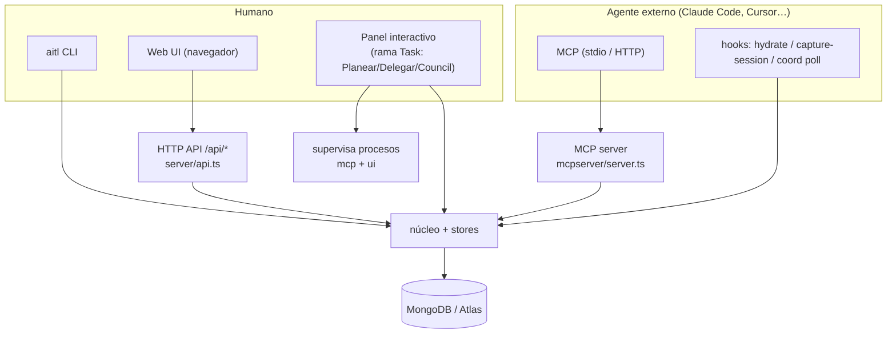

### 12.1 CLI (`src/cli.ts`) — comandos principales

| Grupo | Comandos |
|---|---|
| Bootstrap | `init` (repo en un comando, ADR-0052), `init agent`, `init claude` |
| DB | `check-db`, `init-db`, `migrate-atlas <uri>` |
| Memoria | `ingest`, `search`, `synthesize [--at <ref>] [--compact]`, `memory history` |
| Ejecución | `run [--stream\|--ask\|--mcp\|--verify-cmd\|--bare]`, `chat`, `run-host --host`, `orchestrate --max`, `sdd`, `council --hosts a,b [--judge]`, `models`, `run-show`, `intervene` |
| Repo/ADR | `repomap [--modules]`, `module-brief <dir>`, `index-repo`, `adr-sync`, `adr {history,deprecate}`, `branch {sync,list,rm}`, `software`/`repo` (catálogo) |
| Coordinación | `coord {claim,release,list,poll}` (cursor incremental en `~/.aitl/`) |
| Roles | `role {seed,list,rm,gate-check,review,build}` |
| Cross-tool | `export --adapter <name>`, `sync [--pull\|--push] --project <p>` |
| MCP / UI / Panel | `mcp [--http]`, `ui`, `interactive` (alias: `aitl` a secas, `-i`) |
| Prompts | `prompt {add,list,search}` |
| RBAC | `user {bootstrap,register,create,list,set-role,disable,verify}` |
| Config | `config {path,show,set,unset,export,import}` (`set --env` espeja al `.env`) |
| Hooks | `hydrate`, `capture-session` |

> `aitl eval` fue retirado (ADR-0048): la condición C0 del piloto es `run --bare` y C2 es el
> default con harness. `aitl sync` **siempre** con `--project` explícito: sin él cae al basename
> del cwd y puede ver un Mongo vacío.

### 12.2 MCP server (`src/mcpserver/server.ts`) — herramientas expuestas

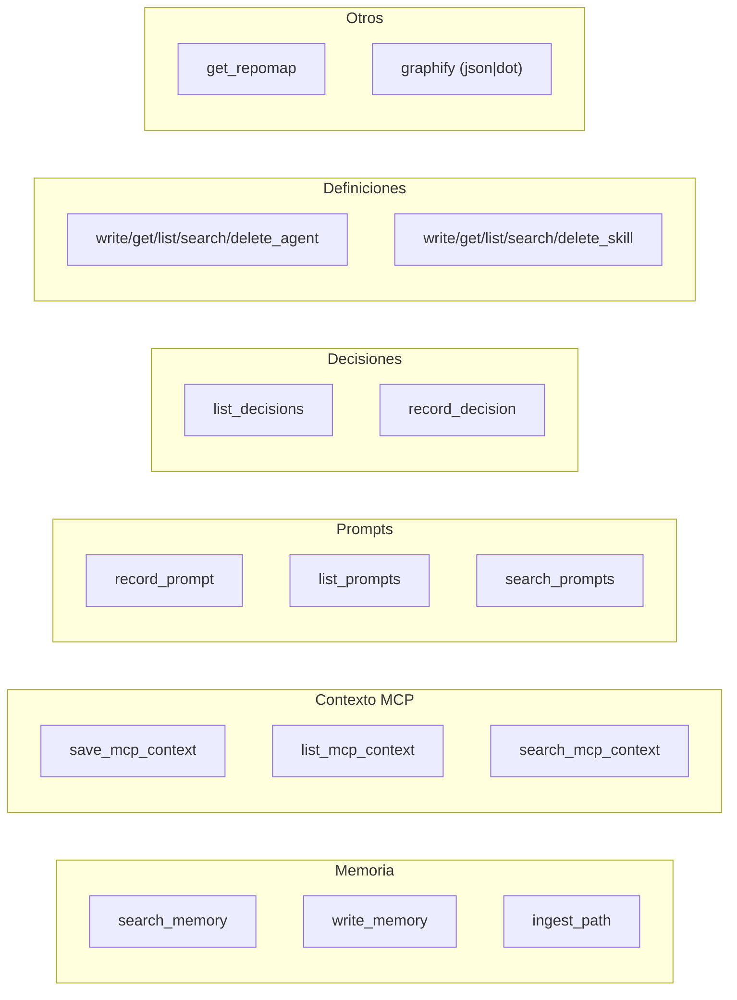

Cada tool pasa por `runLogged()` (mide, audita y persiste en `mcp_tool_calls`) y por `guardTool()`
(RBAC para tools mutadoras). Transportes: **stdio** (local) y **Streamable HTTP** (remoto, con
Bearer opcional). El actor por defecto es `agent` (override por `AITL_MCP_ACTOR_*`).

Además de las del diagrama, el servidor expone: catálogo software/repos/branches
(`write/get/list/delete_software|repo`, `list_branches`, `sync_branches`), historial de versiones
(`list/get_memory_versions`, `list/get_decision_versions`), ciclo de vida
(`deprecate_decision`), mapa de módulos (`get_module_map`, `get_module_brief`), roles
(`seed_roles`, `list_roles`, `write_role`), intervención humana
(`record_human_intervention`) y **coordinación** (`claim_task`, `release_task`, `poll_events`
— recurso RBAC `coordination`, ADR-0054).

### 12.3 HTTP API + Web UI

`server/api.ts` expone REST bajo `/api/*` (health, projects, memory CRUD + search, decisions,
prompts, users) con RBAC por Bearer token (`AITL_WEB_TOKENS`) y auditoría en cada acción.
`server/ui.ts` (`startUi`) arranca la API (puerto 4317) y un SPA React/Vite (puerto 5317). La UI
(`web/`) tiene pestañas **Memory | Decisions | Prompts** con selector de proyecto.

---

## 13. Adapters cross-tool (exportar el "canon")

`aitl export --adapter <name>` proyecta el *canon* del proyecto (conventions + decisions + AGENTS.md)
al formato nativo de cada herramienta (`adapters/base.ts:39`, registro en `getAdapter`).

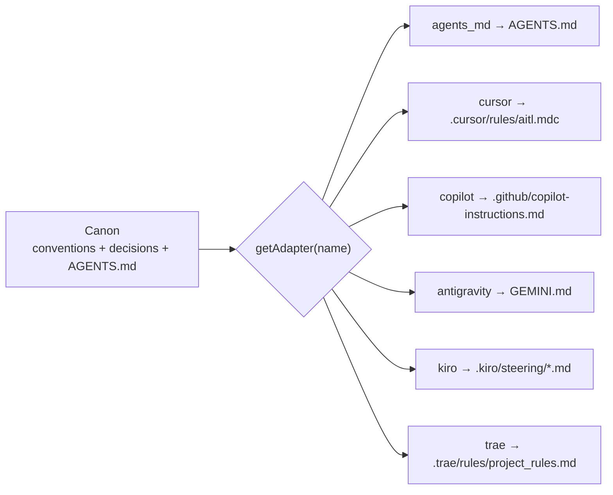

La dirección inversa (importar `AGENTS.md` → `conventions`) la hace `conventions/loader.ts`
(`parseAgentsMd`). `init/agent.ts` genera un `AGENTS.md` que instruye al agente a **consultar el MCP
antes de decidir** y **persistir después** (record_decision / write_memory / record_prompt).

---

## 14. Evaluación (DSR)

El comando `aitl eval` fue retirado (ADR-0048): la comparación del piloto se hace con el propio
loop. **C0** (modelo desnudo) es `aitl run --bare`; **C2** (con harness) es el default. La
instrumentación del piloto (ADR-0032/0033/0034) aporta las métricas: `aitl run-show` (tokens,
eventos, gate denials), `--verify-cmd` como quality gate dentro del loop, `aitl intervene`
(minutos de supervisión humana) y `capture-session` (runs humanos con tokens reales del
transcript del host). El consejo de planeación añade su propia telemetría comparable (run kind
`council`, eventos `council_*` — ADR-0055).

---

## 15. Invariantes de diseño (resumen)

1. **Puertos y adaptadores** — el núcleo solo conoce `ProviderPort/ToolPort/MemoryPort/LoopStrategy`.
2. **Providers detrás de un único puerto** — *(enmendado por ADR-0044; el enunciado original
   "un único gateway = OpenRouter" quedó SUPERSEDED)*: cuatro backends crudos
   (`anthropic` directo + `openrouter`/`lmstudio`/`openai-compat` sobre `OpenAIProvider`)
   resueltos por `getProvider`, con cadena de fallback (`--model auto`); hosts externos vía `HostAdapter`.
3. **Un único punto de escritura** — toda persistencia pasa por los *stores* → MongoDB.
4. **Dos grafos complementarios** — *conocimiento* (`graphify`: memoria/símbolos) y *procedencia*
   (eventos/`runs`). La tesis necesita ambos.
5. **Best-effort en los hooks** — hidratación/resumen/routing nunca rompen el run.
6. **Cascada con degradación** — vector → texto → recencia: funciona sin índice vectorial.
7. **Fallback determinista** — cada paso con LLM tiene alternativa sin LLM.
8. **Conexión resiliente** — primary → fallback URI; migración local↔Atlas sin código.
9. **Gates deterministas** — la seguridad del shell/paths es un gate, no un acuerdo con el agente.
10. **Cambios arquitectónicos = ADR** — registrados en `decisions` vía `record_decision` con el
    **siguiente id libre leído del ledger** en el momento de registrar (nunca fijado en docs;
    el estado del ledger vive en `CLAUDE.md` y en la colección `decisions`).
11. **Degradación explícita** — sin Mongo los flujos corren con aviso y sin persistir; sin
    modelo, alternativa determinista o acción deshabilitada con razón visible (ADR-0052).
12. **Persistir es decisión humana en las superficies interactivas** — la rama Task muestra
    los artefactos antes de escribirlos (confirm-before-persist, ADR-0056).

---

## 16. Índice de símbolos clave

| Símbolo | Archivo:línea |
|---|---|
| `ProviderPort` / `ToolPort` / `MemoryPort` / `LoopStrategy` | `contracts.ts:75/84/92/101` |
| `getProvider` | `providers/base.ts:51` |
| `OpenAIProvider` | `providers/openai.ts:21` |
| `ToolRegistry.call` | `tools/base.ts:57` |
| `denyPathsGate` / `PhaseGate` | `hooks/gates.ts:20/36` |
| `HostAdapter` / `CliHostAdapter` / `getHost` | `hosts/base.ts:28/50/96` |
| `runOnHost` | `hosts/run.ts:33` |
| `runAgent` | `orchestration/graph.ts:89` |
| `orchestrate` | `orchestration/orchestrator.ts:63` |
| `runCouncil` | `council/orchestrator.ts` |
| `makeCouncilClient` / `HostClientAdapter` | `council/adapters.ts` |
| `claimTask` / `releaseTask` | `coord/claims.ts` |
| `pollEvents` / `formatCoordEvent` | `coord/events.ts` |
| `runSddPipeline` / `runSddPipelinePreview` | `specs/pipeline.ts` |
| `computeTaskActions` / `planCouncilSeats` / `detectAvailableHosts` | `interactive/taskLogic.ts` |
| `planFlow` / `delegateFlow` / `councilFlow` | `interactive/task.ts` |
| `ContextManager` | `context/manager.ts:19` |
| `MemoryStore` | `memory/store.ts:18` |
| `hydrate` / `summarizeSession` | `memory/lifecycle.ts:180/251` |
| `Classifier` | `memory/classifier.ts` |
| `Synthesizer` | `memory/synthesizer.ts` |
| `ADRStore` | `decisions/adr.ts` |
| `PromptStore` | `prompts/store.ts:13` |
| `DefinitionStore` | `projectctx/store.ts:19` |
| `routeSkills` | `projectctx/router.ts` |
| `RepoMap` (build/render) | `repomap/store.ts` |
| `rankSymbols` (PageRank) | `repomap/ranker.ts:23` |
| `COLLECTIONS` / `VECTOR_COLLECTIONS` | `db/client.ts:18` / `db/indexes.ts:16` |
| `connectWithFallback` | `db/client.ts:95` |
| `getEmbedder` / `embedOne` | `ingest/embedder.ts` |
| Modelos Mongoose (Run/Message/Memory/Decision/Symbol/Event/TaskClaim…) | `src/models/*.model.ts` |
```
