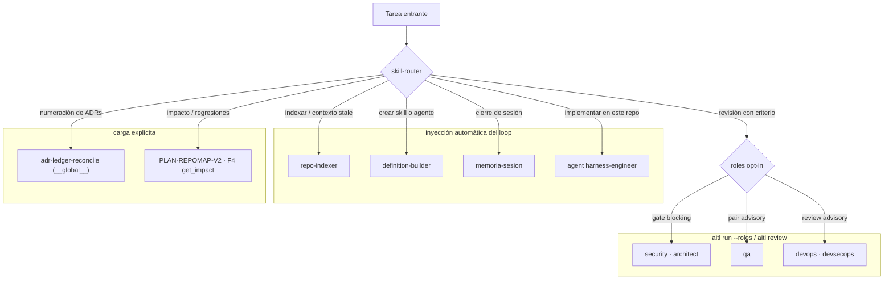

# Mapa de skills, roles y agents — proyecto `aitl-js`

> Estado sembrado el 2026-07-11. Fuente de verdad: colecciones `skills`/`agents` del
> MCP `aitl-js` (los archivos `skills/*/SKILL.md` y `.aitl/` son espejos). Punto de
> entrada operativo: la skill **`skill-router`**.

## Diagrama de enrutamiento

## Skills (colección `skills`)

| Skill | Scope | Trigger (cuándo la enruta/cargas) | Tools MCP que usa | Espejo en disco |
|---|---|---|---|---|
| `skill-router` | `aitl-js` | inicio de toda tarea no trivial; "¿qué capacidad uso?" | `search_skills`, `get_skill`, `list_roles` | `skills/skill-router/SKILL.md` |
| `memoria-sesion` | `aitl-js` | cierre de sesión; "guarda lo aprendido" | `write_memory`, `record_decision`, `record_prompt`, `search_memory` | `skills/memoria-sesion/SKILL.md` |
| `repo-indexer` | `aitl-js` | inicio en un repo; repomap stale (aviso `[repomap] stale`) | `index_repo`, `get_repomap` | `.aitl/skills/repo-indexer.md` |
| `definition-builder` | `aitl-js` | crear/actualizar skills o agentes | `build_definition`, `write_skill`, `write_agent` | `.aitl/skills/definition-builder.md` |
| `adr-ledger-reconcile` | `__global__` | antes de `record_decision`; punteros/numeración dudosos | `list_decisions`, `search_memory`, `write_memory` | `skills/adr-ledger-reconcile/SKILL.md` |

## Roles de ingeniería (colección `agents`, `metadata.kind="role"`)

| Rol | Modo | Severidad | Triggers declarados | denyGlobs | Skill afín |
|---|---|---|---|---|---|
| `security` | gate | blocking | `write_file`, `shell`, `**/auth/**` | `*.env`, `*.pem`, `*id_rsa*`, `**/secrets/**` | — |
| `architect` | gate | blocking | `write_file` | — | `adr-ledger-reconcile` |
| `qa` | pair | advisory | `write_file` | — | — |
| `devops` | review | advisory | — | — | — |
| `devsecops` | review | advisory | — | — | — |

Acoplamiento real (verificado 2026-07-11): `gate` = `PermissionGate` determinista en el
loop (veto atribuido `[role:x]`, sin modelo); `review` **y `pair`** = una crítica por
modelo al cierre del run (`deliberate` → `DecisionBrief`). El campo `triggers` se
persiste pero **no dispara nada** todavía; el acompañamiento continuo del modo `pair`
está pendiente de implementación.

## Agents (colección `agents`, `metadata.kind≠"role"`)

| Agent | Para qué | Binding |
|---|---|---|
| `harness-engineer` | implementación en este repo: consulta MCP antes, `npm run verify` antes de dar por hecho, ADR por decisión | model (loop propio) |

## Cómo llega cada cosa al modelo (superficies)

| Superficie | hydrate (memoria+ADRs+conventions+repomap) | skills | agents | roles |
|---|---|---|---|---|
| `aitl run` / `aitl chat` (1er turno) / `orchestrate` / MCP `run_agent` | ✅ system | ✅ máx 3, ~6000 chars | ✅ (excluye roles) | opt-in `--roles` (solo CLI) |
| `aitl run-host` (host externo) | ✅ prepend al prompt | ❌ | ❌ | ❌ |
| Hook `aitl hydrate` (UserPromptSubmit) | ✅ stdout | ❌ | ❌ | ❌ |

Eventos de trazabilidad: `skills_route` (payload `selected`; `kind:"agent"` para el
preámbulo de agents) · `hydrate` (desglose por sección) · `gate` · `review`/`role_veto`/`deliberation`.

## Límites conocidos (no sorpresas)

1. El router solo consulta el **project del run** — las skills `__global__` exigen
   `get_skill(project="__global__", …)` explícito (E6 pendiente; dependencia declarada
   en la propia `adr-ledger-reconcile`).
2. `run_agent` (MCP) no expone `roles`: los roles solo se acoplan por CLI.
3. Máximo 3 skills y 3 agents por corrida (límite del router, presupuesto por sección).
4. `aitl run --bare` (condición C0) apaga TODO el mapa: sin hydrate, sin skills, sin gates.

## Mantenimiento del mapa

- Alta/edición de skill: `build_definition` o `write_skill` (upsert por `(project, name)`)
  → actualizar la tabla de `skill-router` y este doc → `aitl sync --pull` espeja a `.aitl/`.
- Los archivos `skills/*/SKILL.md` de la raíz son formato Claude-Code-nativo: al
  registrarlos en Mongo, el `content` es el markdown completo (frontmatter incluido).
- Verificación rápida del ruteo: `npm test` incluye `src/projectctx/router.test.ts`
  (selección, fallback a recencia, filtro de roles, presupuesto).
